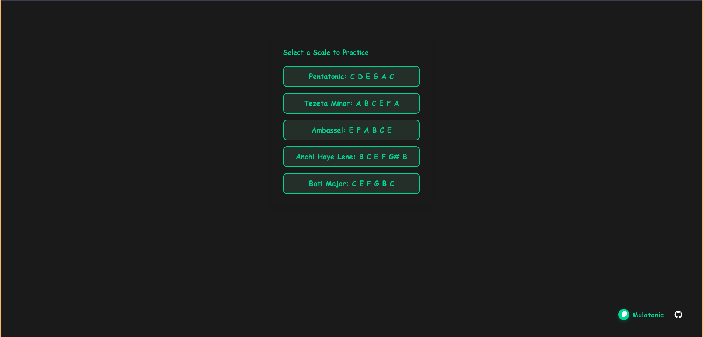
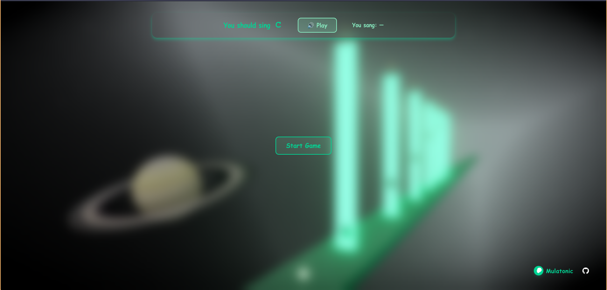
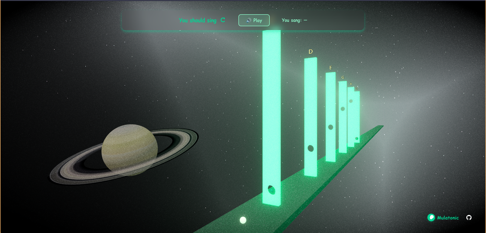

# Mulatonic

**Mulatonic** is an interactive web-based 3D game that helps you practice singing major ethiopian pentatonic scales through gamified experience. This project is dedicated to honoring the legacy of Mulatu Astatke, the legendary pioneer of Ethio-jazz.

---

## 📷 Screenshots

Screenshots of the experience can be found in the `screenshots/` directory:

- 
- 
- 

---

## 🌍 About Mulatu Astatke

Mulatu Astatke is widely known as the father of Ethio-jazz, a genre blending traditional Ethiopian music with jazz and funk.
This project is a tribute to Mulatu’s influence in ethiopian music history. Learn more about him [here](https://en.wikipedia.org/wiki/Mulatu_Astatke)
